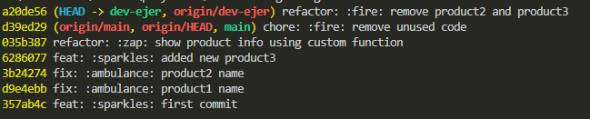

    URL del repositorio propio (donde respaldaron su proyecto).
    - https://github.com/Ruben0x/inventario

    Evidencia de los 5 commits (captura o enlace a “Commits”).

    - https://github.com/Ruben0x/inventario/commits/main/

    Evidencia de la rama dev-ejer (captura o enlace a “Branches”).

    - https://github.com/Ruben0x/inventario/branches

    URL del fork creado del repo reciclajeans.

    . https://github.com/Ruben0x/reciclajeans

